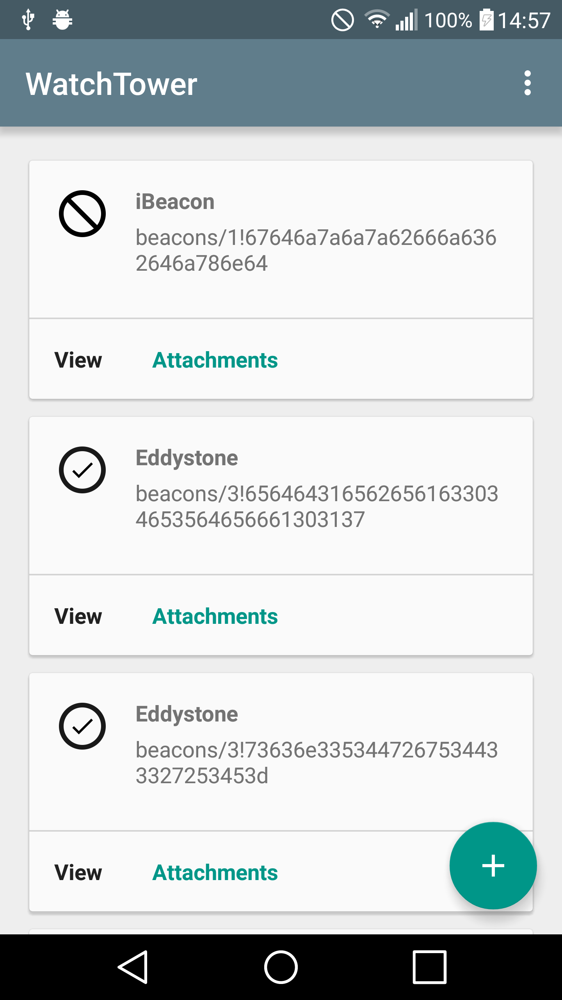

WatchTower
===================

    

Note: In order to use this app, you'll need to use the Google API Console to register your SHA1 token along with the package name, this app won't work otherwise.

WatchTower is a simple application which was created to test and explore the functionality of the new [Proximity Beacon API](https://developers.google.com/beacons/proximity/guides). The application can be used to try out:

- Registering Beacons
- Updating Beacons
- Viewing Beacons
- Viewing Beacon Diagnostics
- Viewing Beacon Attachments
- Adding Beacon Attachments
- Deleting Single Beacon Attachments
- Deleting Batch Beacon Attachments by Type

Some features are not very practical within a mobile-app (for example, adding json data to attachments), so these have not been included.

    

Note: This was built *quickly* to simply test the APIs functionality. If you come across any bugs please feel free to submit them as an issue, or open a pull request ;)

For further information, please read the [supporting blog post](https://medium.com/ribot-labs/exploring-google-eddystone-with-the-proximity-beacon-api-bc9256c97e05).

Requirements
------------

 - [Android SDK](http://developer.android.com/sdk/index.html).
 - Android [5.1 (API 22) ](http://developer.android.com/tools/revisions/platforms.html#5.1).
 - Android SDK Tools
 - Android SDK Build tools 22.0.1 
 - Android Support Repository
 - Android Support library
 - Enabled [Unit Test support] (http://tools.android.com/tech-docs/unit-testing-support)

Building
--------

To build, install and run a debug version, run this from the root of the project:

    ./gradlew installRunDebug
    
Testing
--------

For Android Studio to use syntax highlighting for Automated tests and Unit tests you **must** switch the Build Variant to the desired mode.

To run **unit** tests on your machine using [Robolectric] (http://robolectric.org/):

    ./gradlew testDebug
    
To run **automated** tests on connected devices:

    ./gradlew connectedAndroidTest
    
Attributions
------------

Thanks to the following for icons off of Noun Project:
 
[Stéphanie Rusch](https://thenounproject.com/BeezkOt) - Beacon Icon  
[Abraham](https://thenounproject.com/gorilladigital) - Cloud Icon 
[S.Shohei](https://thenounproject.com/shohei909) - Battery Icon 
[Juergen Bauer](https://thenounproject.com/Juergen) - Alert Icon 
[Pham Thi Dieu Linh](https://thenounproject.com/phdieuli) - Attachment Icon 
